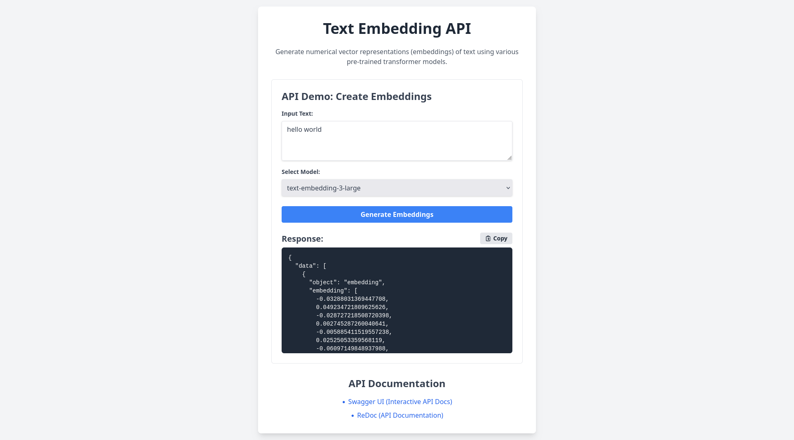

# 🧠 Text Embedding API Server
[](https://github.com/atrifat/text-embedding-api/actions/workflows/python-ci.yml)

[](https://codecov.io/gh/atrifat/text-embedding-api)

A Text Embedding API server built with FastAPI and Hugging Face Transformers, designed to be compatible with OpenAI's and Ollama's Embeddings API formats.



## ✨ Features

- 🚀 **FastAPI Backend**: Built with FastAPI, providing an asynchronous API.
- 🤖 **Hugging Face Transformers Integration**: Supports various pre-trained transformer models for generating embeddings.
- ⚡ **Model and Embeddings Caching**: Incorporates in-memory caches for loaded models, tokenizers, and generated embeddings to enhance response times.
- 📦 **Batch Processing**: Supports processing multiple text inputs in configurable batches, with model-specific optimizations.
- ⚙️ **Enhanced Model Compatibility and Processing**: Includes advanced handling for various model requirements, such as specific padding strategies and sequential processing for certain models.
- 🤝 **OpenAI and Ollama API Compatibility**: The `/v1/embeddings` endpoint is compatible with the OpenAI Embeddings API, and the `/api/embed` endpoint is compatible with the Ollama Embeddings API.

## 🏗️ Architecture Overview

The application is designed around a FastAPI server (`app.py`), which offers endpoints for generating text embeddings and listing available models. The core logic is organized into several modules to enhance clarity and maintainability.

### Key Components:

- **`app.py`**:
  - Sets up the FastAPI application, including CORS middleware and static file serving.
  - Manages application startup and shutdown events, such as cache initialization and model warmup.
  - Defines Pydantic models for API request and response validation.
  - Exposes API endpoints for the root path (`/`), model listing (`/v1/models`), specific model information (`/v1/models/{model_id}`), and embedding generation (`/api/embed`, `/v1/embeddings`).
- **`config.py`**:
  - Manages application-wide settings using Pydantic's `BaseSettings`, covering aspects such as host, port, default models, cache sizes, and CORS origins.
- **`model_loader.py`**:
  - Manages the loading of Hugging Face models and tokenizers.
  - Employs in-memory caches for models and tokenizers to optimize performance.
  - Handles device assignment (CPU or GPU) for models.
- **`embedding_processor.py`**:
  - Contains the core logic for generating text embeddings.
  - Implements caching for generated embeddings to reduce redundant computations.
  - Manages batch processing of text inputs and applies instruction prefixes as required by specific models.
  - Includes error handling mechanisms, such as for CUDA Out of Memory conditions.
- **`models_config.py`**:
  - Defines `CANONICAL_MODELS` with detailed configurations (e.g., dimension, max tokens, instruction prefixes) for each supported Hugging Face model.
  - Defines `MODEL_ALIASES` to map common names to canonical model names.
  - Provides a `get_model_config` function to retrieve the full configuration for a given model name.

## ⚙️ Setup and Installation

### Prerequisites

- Python 3.10+
- `pip`

### Installation

1.  **Clone the repository:**
    ```bash
    git clone https://github.com/your-repo/text-embedding-api.git
    cd text-embedding-api
    ```
2.  **Create a virtual environment (recommended):**
    ```bash
    python -m venv venv
    source venv/bin/activate # On Windows, use `venv\Scripts\activate`
    ```
3.  **Install dependencies:**
    ```bash
    pip install -r requirements.txt
    ```
4.  **Download necessary models (optional, models are downloaded on first use):**
    Models are downloaded from the Hugging Face Hub on demand. An active internet connection is required for the initial download of each model.

### Configuration

Application configuration can be managed via environment variables or a `.env` file in the project's root directory.

First, copy the example environment file:

```bash
cp .env.example .env
```

Then, edit the `.env` file to set your desired configuration.

Example `.env` file:

```
DEFAULT_MODEL=text-embedding-3-large
EMBEDDING_BATCH_SIZE=8
EMBEDDINGS_CACHE_ENABLED=True
EMBEDDINGS_CACHE_MAXSIZE=2048
CUDA_CACHE_CLEAR_ENABLED=False # Set to True to clear CUDA cache after each inference, potentially reducing memory usage but increasing latency.
APP_PORT=7860
PYTORCH_CUDA_ALLOC_CONF=expandable_segments:True # Optimization for PyTorch to manage CUDA memory more flexibly.
APP_HOST=0.0.0.0
ENVIRONMENT=development
REPORT_CACHED_TOKENS=False
ALLOWED_ORIGINS=["*"] # Comma-separated list of allowed origins for CORS (e.g., "http://localhost:3000,https://example.com"). Use ["*"] to allow all origins.
```

### Running the Server

```bash
uvicorn app:app --host 0.0.0.0 --port 7860 --reload
```

Or, using the `if __name__ == "__main__":` block:

```bash
python app.py
```

## 🔗 API Endpoints

### 1. List Available Models

`GET /v1/models`

Returns a list of all embedding models available on the server.

**Example Response:**

```json
{
  "data": [
    {
      "id": "all-MiniLM-L6-v2",
      "object": "model",
      "created": 1678886400,
      "owned_by": "local"
    },
    {
      "id": "text-embedding-3-large",
      "object": "model",
      "created": 1678886400,
      "owned_by": "local"
    }
  ],
  "object": "list"
}
```

### 2. Get Model Information

`GET /v1/models/{model_id}`

Returns information about a specific embedding model.

**Example Response (for `model_id=text-embedding-3-large`):**

```json
{
  "id": "text-embedding-3-large",
  "object": "model",
  "created": 1678886400,
  "owned_by": "local"
}
```

### 3. Create Embeddings

`POST /v1/embeddings` or `POST /api/embed`

Generates embeddings for the given input text(s). Compatible with OpenAI's Embeddings API.

**Request Body:**

```json
{
  "input": "This is an example sentence.",
  "model": "text-embedding-3-large",
  "encoding_format": "float"
}
```

Or for multiple inputs:

```json
{
  "input": ["This is the first sentence.", "This is the second sentence."],
  "model": "text-embedding-3-large",
  "encoding_format": "float"
}
```

**Example Response (`/v1/embeddings` - OpenAI-compatible):**

```json
{
  "data": [
    {
      "object": "embedding",
      "embedding": [0.1, 0.2, ..., 0.9],
      "index": 0
    }
  ],
  "model": "text-embedding-3-large",
  "object": "list",
  "usage": {
    "prompt_tokens": 10,
    "total_tokens": 10
  }
}
```

**Example Response (`/api/embed` - Ollama-compatible):**

```json
{
  "embeddings": [
    [
      -0.006929283495992422,
      -0.005336422007530928
    ]
  ],
  "usage": {
    "promptTokens": 5,
    "totalTokens": 5
  }
}
```

## 📚 Available Models

The models configured in `models_config.py` are listed below. Aliases like `text-embedding-3-small` and `text-embedding-3-large` are provided for OpenAI API compatibility; however, the actual embedding dimensions are determined by the underlying Hugging Face models used by this server and may differ from OpenAI's native models.

| Canonical Name          | Alias (OpenAI-compatible)              | Dimension | Max Tokens | Pooling Strategy | Max Batch Size | Processing Strategy | Requires Max Length Padding | Instruction Prefix Required | Default Prefix     |
| :---------------------- | :------------------------------------- | :-------- | :--------- | :--------------- | :------------- | :------------------ | :-------------------------- | :-------------------------- | :----------------- |
| `all-MiniLM-L6-v2`      | `all-minilm`, `text-embedding-3-small` | 384       | 512        | `mean`           | 32             | `parallel`          | No                          | No                          | -                  |
| `gte-multilingual-base` | `text-embedding-3-large`               | 768       | 8192       | `cls`            | 32             | `parallel`          | No                          | No                          | -                  |
| `nomic-embed-text-v1.5` | `nomic-embed-text`                     | 768       | 8192       | `mean`           | 8              | `parallel`          | No                          | Yes                         | `search_document:` |
| `all-mpnet-base-v2`     | -                                      | 768       | 384        | `mean`           | 32             | `parallel`          | No                          | No                          | -                  |

## 🧑‍💻 Development

### Running Tests

(Assuming `pytest` is installed via `requirements.txt`)

```bash
pytest
```

### Local Development Checks (Pre-commit Hooks)

To maintain code quality, formatting, and test integrity, this project uses `pre-commit` hooks. These hooks execute automatically on staged files before each commit.

1.  **Install `pre-commit` and project dependencies**:
    Ensure you have a virtual environment activated, then install the development dependencies:
    ```bash
    pip install -r requirements.txt
    ```

2.  **Install the Git hooks**:
    Navigate to the project's root directory and run:
    ```bash
    pre-commit install
    ```
    This command sets up the Git hooks based on the configuration in [`pre-commit-config.yaml`](.pre-commit-config.yaml).

Upon installation, `pre-commit` automatically performs checks (including linting, formatting, and testing) on staged changes before a commit is finalized. If any checks fail, the commit process is halted, allowing for immediate issue resolution.

To manually run all pre-commit checks on your entire codebase at any time, use:
```bash
pre-commit run --all-files
```

## 🚀 Continuous Integration

This project utilizes GitHub Actions for continuous integration. The CI pipeline automatically runs checks on every push and pull request to the `main` branch, ensuring code quality, functionality, and security.

The CI workflow is defined in [`python-ci.yml`](.github/workflows/python-ci.yml) and includes the following steps:

*   **Environment Setup**: Configures multiple Python versions (3.8 to 3.12).
*   **Dependency Installation**: Installs project dependencies, linters, and testing tools.
*   **Linting**: Runs `flake8` to enforce code style and identify errors.
*   **Testing**: Executes unit and integration tests using `pytest` and generates a code coverage report.
*   **Security Scan**: Performs a security audit of project dependencies using `pip-audit`.
*   **Docker Image Build**: Automates the building and pushing of Docker images to GitHub Container Registry (GHCR).

## 📄 License

This project is licensed under the MIT License. See the [`LICENSE`](LICENSE) file for details.
